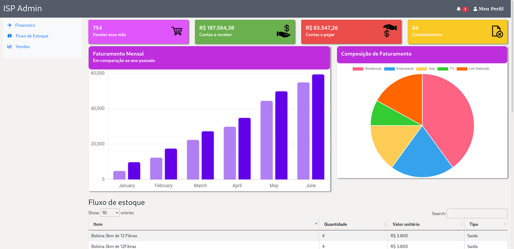

  

<h3 align="center">ISP Admin</h3>

---

 Few lines describing your project.
      

## 📝 Table of Contents

- [Sobre](#about)   
  - [Responsividade](#responsive)
- [Como abrir](#getting_started)
- [Ferramentas utilizadas](#built_using)
 

## 🧐 Sobre 

O ISP Admin é um projeto estático que deverá ser entregue como um dos projetos do treinamento FULL STACK oferecido pelo Instituto de pesquisa eldorado.
O objetivo do projeto é criar uma página de login junto com uma dashboard, os itens adicionados na dashboard ficaram a cargo da imaginação do autor.

O cenário escolhido foi para uma dashboard de um ISP - *Internet service provider*, que é um provedor de internet. Durante a primeira semana aprendemos muito principalmente sobre CSS e o framework Bootstrap que foram a base para este projeto.

### 🧐 Responsividade 
Um dos requisitos mais desejados para o projeto é a responsividade, garantir que independente do tamanho da tela do dispostivo que acessar o site, o usuário terá o minimo de condições para utilizar a dashboard. Como é possível ver abaixo, Este projeto atende a o requisito da responsividade. 
 

## 🏁 Como abrir 

O Projeto foi construido de forma estática; utilizando HTML5, CSS3 e um pouco de JavaScript. Portanto, deve ser simplesmente aberto o arquivo **login.html** em qualquer navegador.

Como não há nenhuma validação de usuário e senha, qualquer *emal* e *senha* devem abrir a dashboard. 

## ⛏️ Ferramentas Utilizadas 

- [HTML] - Linguagem para de marcação.
- [CSS] - Linguagem de estilo.
- [JavaScript] - Criando Datatables.
- [ChartJS] - Criação de um dos gráficos dispostos na dashboard.
- [DataTable] - Criando tabelas interativas.
- [Jquery] - Dependencia da biblioteca datatable.

